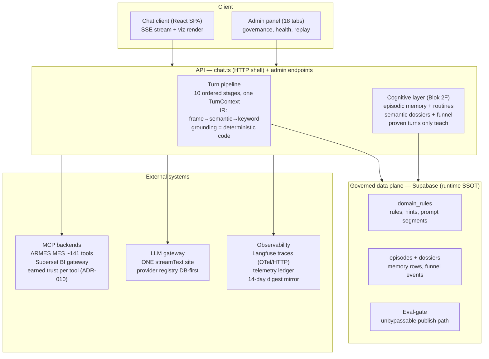
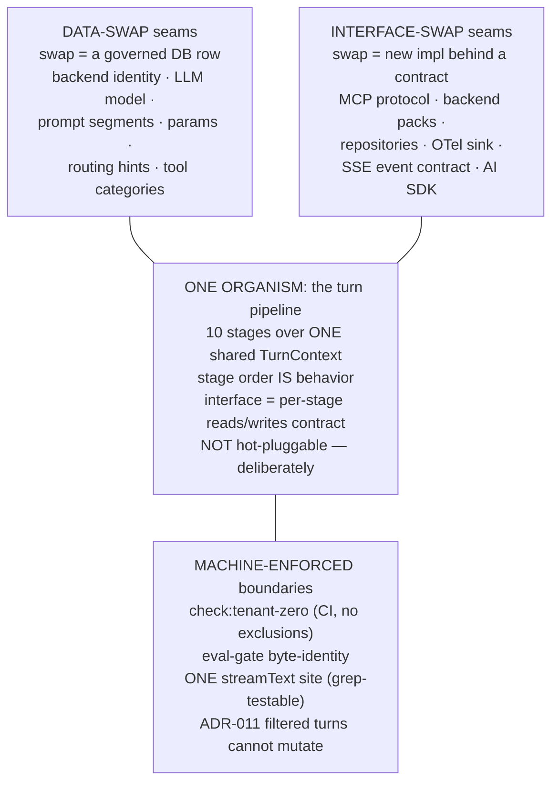

# CWF — Vision Note: Modularity, Interfaces & Multi-Agent Scaling
**cwf-vision-note-MODULARITY-AND-MULTI-AGENT-S88-v1 · 2026-08-08 · S88**

> **STATUS: DISCUSSION CAPTURE — NON-BINDING.** This note records an owner⇄Architect
> architecture conversation held during S88 while the AG lanes ran PROCEDURE-YIELD-1 and
> READY-EDIT-TRUTH-1. It legislates nothing. **Owner ruling (S88, binding): the current
> rhythm is NOT broken for this — the rollout (Blok 2F memory layers, graph memory,
> BM25/hybrid search, SOTA measurement) completes FIRST.** Re-entry trigger: rollout
> completion / SOTA tests passed ("the governed agent exits imbecile mode"). At 2F close
> the Architect returns with named items and a sequencing proposal (§7).
> Everything here follows S37-1: this artifact is immutable; amendments are v1_2+.

---

## 1 · The component map (as verified in S88)

Derived from a live read of the fresh clone at S88 boot (`docs/turn-pipeline.md` +
`chat.ts` + directory census), not from memory (S65-1).



Layer boundaries that matter: the pipeline READS governed data; rules are written only
through the gated admin UI + eval-gate; memory rows are written only by proven turns
(hardened in S88 by PROCEDURE-YIELD-1: *"Hata yokluğu başarı değildir"* — the absence of
a failure signal no longer stands in for the presence of a success signal). All three
external doors carry their own trust model: backends earn trust per tool (ADR-010), the
LLM has exactly one completion site, observability is three never-conflated systems
(ledger ≠ trace ≠ digest, ADR-004/008).

## 2 · A query's journey (the sequence)

```mermaid
sequenceDiagram
  participant U as User (SSE)
  participant P as Turn pipeline
  participant S as Supabase (SSOT)
  participant M as MCP backends
  participant L as LLM gateway
  participant O as Langfuse

  U->>P: query arrives, turn opens
  P->>M: 1-2 resolve MCP + backends (warm cache, RBAC scope)
  P->>S: 3-5 telemetry init, persistence, message enqueue
  Note over P: 6 resolve provider (DB-first / code-floor)
  Note over P: 7 register tools + IR frame capture
  P->>S: 8 assemble prompt + memory retrieve<br/>(episodes; v-floor; failed rows excluded)
  Note over P: 9 warm trust + final messages
  loop 10 · stream (the loop)
    P->>L: streamText (the ONE site)
    L->>M: tool calls (search_tools / call_tool)
    M-->>P: results — counted at [ToolResult]:<br/>toolYield accumulates, empty≠zero both shapes
    Note over P: grounding checks (deterministic), delta paint
  end
  P->>S: post-turn distill: episode + funnel always;<br/>procedure + dossier ONLY on yield or landed viz
  P->>O: flush — writes settle, traces force-flush, one turn id
  P-->>U: done
```

The three seams the last three sessions were stitched into: **stage-8 retrieval** (three
gates: write-side proven-only, read-side failed/v1 exclusion, client-side clean history —
plus S88's fourth question *"did anything come BACK?"*), **the stage-10 loop** (gateway
wrapper + per-result yield counting; grounding is code, never an LLM judge, ADR-001), and
**post-turn distillation** (one `[MemoryWrite]` line feeds three organs; the shared
predicate kills both junk classes at the same door).

Known, named gaps visible on this map: a successful discovery search still counts as
yield (**PROCEDURE-YIELD-2**, registered), and a chart macro with no fetch behind it
satisfies the viz arm (grounding-layer work). Neither is a surprise.

## 3 · Seam classification — how modular is it TODAY, honestly



Block-by-block verdict (each claim grep-verified in the S88 clone):

- **Genuinely pluggable:** MCP backends are the strongest seam and the EAIP thesis
  itself — backend identity is a ROW (not an enum, not a migration); all backend
  knowledge lives in `knowledge/backends/<name>/`; eval-gate extension is additive
  per-backend dispatch. Proven in production: Superset was added without touching a line
  of ARMES. The LLM provider is the same class (registry DB-first; ONE completion site
  means a provider swap touches one file). Observability sits behind OTel — any
  OTLP/HTTP sink replaces Langfuse without the pipeline knowing (RULE 27's no-op
  passthrough is standing proof).
- **Contract-swappable with named leaks:** the repository layer is interfaced and
  exercised against in-memory fakes — S87/S88's READY-EDIT-TRUTH-1 aliasing catch is
  live proof the seam is real (the fake diverged from the DB and a test caught exactly
  that divergence). But Supabase semantics leak in two places: RLS's row-level authority
  model and PostgREST's signal-less 1000-row truncation (the partial≠complete law is the
  patch over that leak). Named debt, not hidden debt.
- **Deliberately ONE organism:** the 10 pipeline stages are sequential mutation over a
  shared `TurnContext`; stage ORDER is behavior. The interface exists but in a different
  style — a documented per-stage reads→writes field contract, one span per stage. A
  stage is replaceable by honoring the same contract; it is not a runtime plugin. This
  is a decision, not a gap: byte-level diagnosability (S73-1) outranks modularity.
  The eval-gate is deliberately non-swappable — unbypassability is its reason to exist.
- **The critical point:** most boundaries are guarded by MACHINE, not convention. One
  tenant word in the core breaks CI; a second streamText site is grep-caught; the
  eval-gate engine demands byte-identity. "Well-defined interface" is a gate that runs
  on every PR, not an architect's promise.

**Summary ruling: backends, models, prompts, rules, observability → plug-and-play.
The turn's spine → one piece, on purpose.** A new block enters by class: a data row goes
through the admin UI; a contract seam gets a pack/repo; touching the spine opens a phase.

## 4 · If we typed the interfaces — the four contract classes

The right target model for this system is **hexagonal (ports & adapters) around a
deliberately sequential core** — not microservices.

1. **Stage contract.** Promote today's `turn-pipeline.md` reads/writes table from
   documentation into the type system: each stage becomes `Stage<Reads, Writes>` with
   compile-time-restricted ctx field access. Behavior-preserving; the cheapest
   "interfacing" move available — a doc-to-type promotion.
2. **Backend pack contract.** Already half-real: formalize
   `BackendPack = { promptPack, gatewayRules, render, semantics, blindSpots, evalDispatch }`
   so a third backend is delivered as a pack without reading a core file. Our most
   mature port.
3. **Organ contracts.** Memory organs: `distill(ctx, outcome) → rows | null`,
   `retrieve(key) → offer | null`. Funnel: a versioned `turn_done` event schema. SSE and
   telemetry events are the same class: **schema = interface.**
4. **Repository contracts.** Already present and battle-tested (the aliasing catch).

**The hidden trap, named (per the recurring-trap discipline): an interface is not free —
every interface boundary is a place where behavior can silently diverge.** Our
constitutional laws are mostly things interfaces make HARDER: `empty≠zero` must survive
through the render layer (an interface in between doubles the test surface);
"byte-identical eval-gate" loses meaning across module boundaries; S82-5's hand-built
fake class gets a new breeding ground at every seam. And the RULE-25 economy: today
every phase is auditable from one fresh clone down to a byte. Eight modules mean eight
versioned interfaces; review shifts from "is this commit right?" to "is this interface
matrix compatible?" — which distributes comprehension rather than easing it.

**Owner's framing that lands (S88):** the car-platform / PC-build analogy. The chassis
(MQB-style) never changes across models; engines, gearboxes, bodies attach at defined
mount points. Mapped: chassis = turn pipeline + gates (never swapped — they ARE the road
handling); engine = LLM provider (already a DB row); body = backend pack; peripherals =
tools and organs. The target was never "everything pluggable" — it is **"chassis fixed,
edges are ports, every boundary machine-guarded."** We are already halfway there.

## 5 · Multi-agent scaling — what 5–8 AG lanes actually requires

Empirical base (S87/S88, measured not argued): two AG lanes ran concurrently THREE times;
the Architect computed the file overlap between the lane branches before each second
merge — **zero code files**, intersecting only on three shared seal surfaces
(`manifest.json`, `.agents/CHANGELOG.md`, `SKILL.md`). Spaghetti means "everything
touches everything"; two parallel jobs touched each other nowhere. The one collision we
DID hit — both lanes independently authoring "rev 215", merging with no git conflict —
is the empirical proof of where the monolith bites: **shared seal surfaces**.

Why the current multi-agent setup works at all — and the precondition for scaling it:
every agent has (a) a NARROW SURFACE, (b) a VERIFIABLE ARTIFACT, and (c) an independent
AUDIT (fresh-clone RULE-25). Without all three, eight agents produce eight times the
unverified claims.

The three real bottlenecks (none of them is "the code structure"):
1. **Shared seal surfaces** — every lane pair meets at the manifest/CHANGELOG.
   Remedy: shard the seal (per-tab hashes already exist; a per-tab docVersion shrinks
   the collision surface).
2. **Merge serialization** — N lanes already imply an O(N) sequential reseal chain.
   Remedy: a merge queue with the combined-reseal obligation attached to position, not
   to a lane.
3. **Architect RULE-25 bandwidth** — auditing eight reports at equal depth consumes the
   time eight lanes save. Remedy: formalize the lane-territory map (today enforced by
   prose — "AG-2 territory, disjoint" — it held three times; make it a checked
   declaration).

All three remedies are incremental — they layer onto the existing architecture, no
rewrite.

## 6 · The sub-agent vision — mapped to what already exists

**Owner vision (S88):** the super-agent spawns a dedicated sub-agent per backend —
connect, discover to the bottom, own that backend's work; other sub-agents optimize
learning in the background while the system serves. Long term: system-level
specialization (orchestrator + experts), because single-agent pipes won't carry it.

**Architect mapping — the vision already lives in the plan under the word "organ":**
- *"a dedicated per-backend discovery sub-agent"* = **TOOL-BEHAVIOR-CENSUS-1**
  (design note v1, BINDING): R1 connect-probe · R2 experience ledger · R3 cron+fresh
  rescan · R4 backend-evolution tracking · R5 zero hand-authored rules.
- *"a background learning optimizer"* = **PLANNER-0** (+ hint-retirement commitment)
  and **ROUTER-DISTILL-1** (parked, measurement-triggered re-entry).
- The turn already contains the seed of system-level specialization: the semantic router
  is a SECOND completion site — a governed small model. The "one big model does
  everything" assumption was already broken at the IR layer.

**The identity-defining difference:** these are built as **governed processes**, not
free-roaming agents. ADR-002's spirit extends to agents: no mode carries repo-write and
DB-write simultaneously; authority binds to a connection, not a spoken claim. A future
"backend discovery agent" is a FOURTH LANE with its own fence, its own tool surface, and
its own auditable artifact — the way Gemini is the Operator. A contracted organ, not an
anthropomorphic assistant.

Terminology note for future discussions: MoE (mixture of experts) is INTRA-model routing
between layers of one model. What the owner describes is SYSTEM-level specialization
(orchestrator + expert agents). Different layer, different literature.

## 7 · Named reservations for post-rollout re-entry

Reserved BY NAME (not opened — S74-1 forbids opening while 2F runs; S82-6 does not
apply because no architectural necessity is yet established, this is a scaling option):
- **STAGE-CONTRACT-TYPES** — promote the stage reads/writes table into `Stage<Reads,
  Writes>` types; behavior-preserving.
- **LANE-TERRITORY-1** — formalize the lane-territory map as a checked declaration
  (today: prose discipline that held 3×).
- **SEAL-SHARD-1** — per-tab docVersion sharding to shrink the dual-lane seal collision
  surface.
- **Sub-agent lanes** (post-SOTA discussion): census worker, learning optimizer,
  tenant-onboarding — each as a fenced fourth-lane candidate under the ADR-002 extension
  principle.

At Blok 2F close the Architect returns with these four and a committed sequencing
proposal. Until then: rhythm unchanged, rollout first.

---

## Appendix · Evidence anchors (S88, computed not asserted)
- Dual-lane zero-overlap: `comm -12` of the two branch file lists → only
  `manifest.json` + `.agents/CHANGELOG.md` + `SKILL.md`.
- Seal collision witnessed: both lanes authored "rev 215"; second merge resealed the
  combined tree to **rev 216** (master `3d6b056`).
- ONE streamText site: `grep -rln "streamText(" api/ src/` → `api/cwf/_lib/llm/gateway.ts`
  only.
- Repository seam proof: READY-EDIT-TRUTH-1's in-memory-fake aliasing divergence, caught
  by test, fixed by diff-before-write.
- Backend packs on disk: `api/cwf/_lib/knowledge/backends/{armes,superset}`.
- Merges this session: PROCEDURE-YIELD-1 `8292168` · READY-EDIT-TRUTH-1 `3d6b056`
  (rev 216).

<!-- END · cwf-vision-note-MODULARITY-AND-MULTI-AGENT-S88-v1 -->
